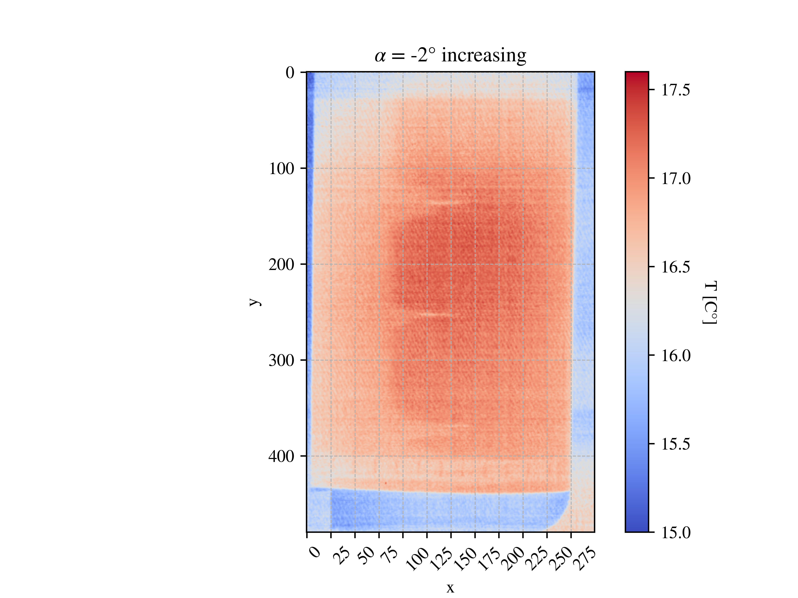

This project supports report for AE2130-II Low Speed Wind Tunnel Test course.
Purpose of the code is to generate polar curves based on the simulated and experimentally obtained data during Low Speed Wind Tunnel Test. Moreover, code creates heat distribution plots over a 2D wing over a range of angles of attack.

To run polar generation, initiate main.py and follow input instructions in the console. You have a choice to generate Experimental (2D), Numerical (3D) or combined(both) data polars. The generated polars are saved to the polars folder in the repo.
To run heatmap generation, run heatmaps.py and observe the generated plots, which are also saved into heatmaps directory. 

Sample combined lift to drag coefficient polar:

Sample heatmap:

